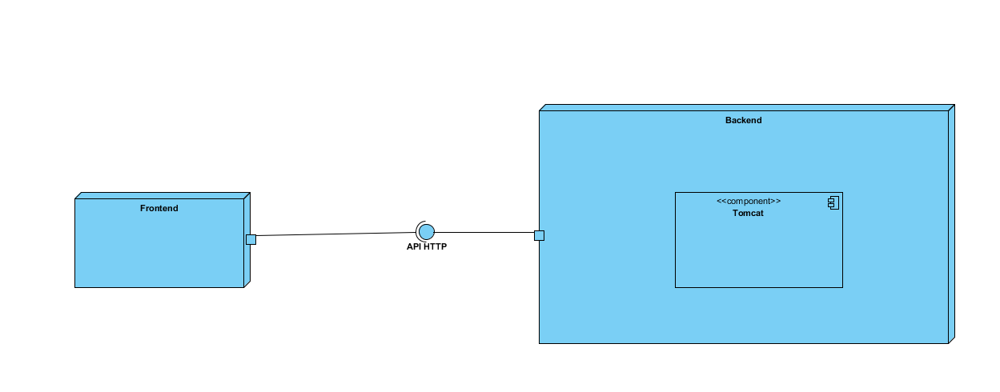
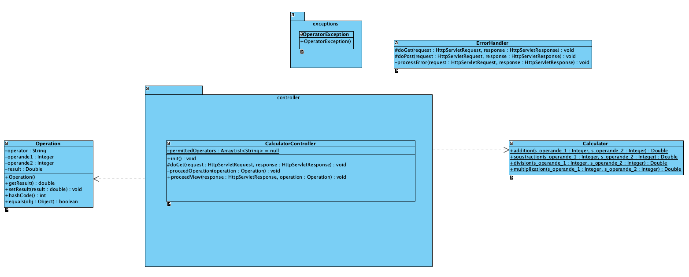
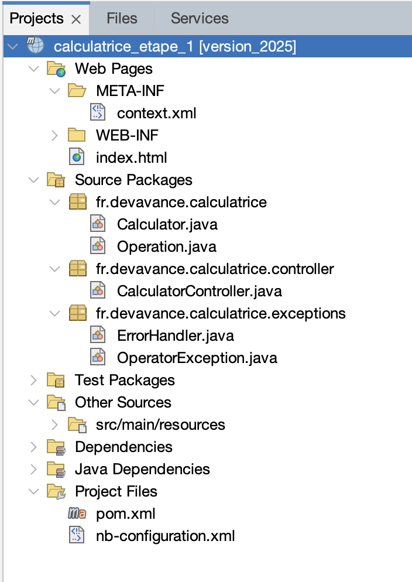
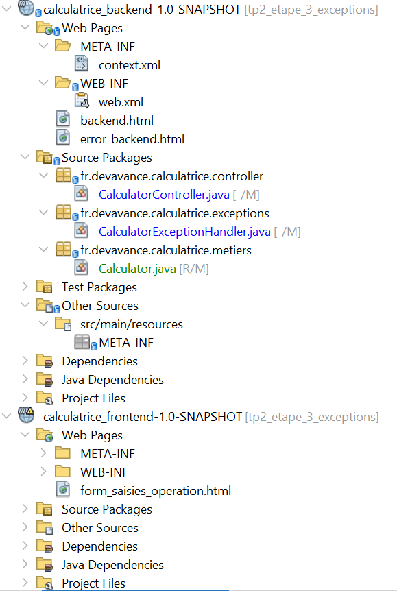
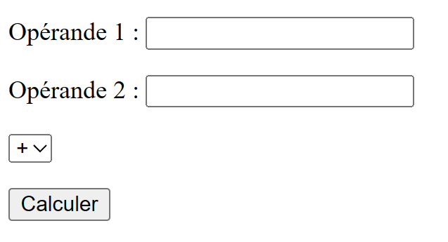
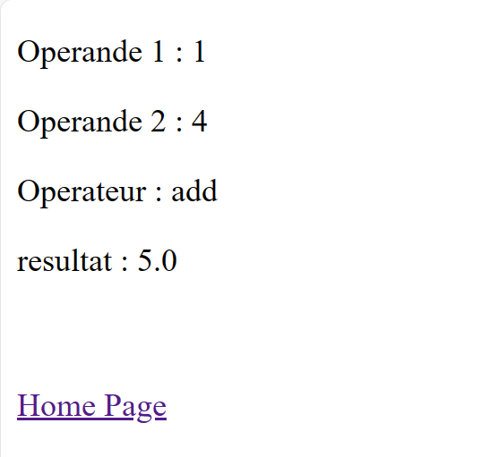

# TP2 — Développement d’une calculatrice avec Servlets

---


**Vous rédigerez un rapport de vos travaux (réponses aux questions posées) et déposerez l’application finale obtenue.**

---

### TP2 - Calculatrice (backend)

#### ⚙️ Architecture logicielle de l’application

##### Diagramme de déploiement

Voici le **diagramme de déploiement simplifié** :



*Conseil :* Ouvrir l'image dans un nouvel onglet du navigateur Web pour plus de confort de lecture.

- La partie **backend** implémente une interface **API HTTP** qui offre des services.  
- La partie **frontend** consomme ces services.

👉 Le **backend** repose sur un **serveur Tomcat** qui héberge des **servlets**.

##### Diagramme de classes

L’application suit le **pattern MVC** :  




##### Proposition de structure des projets NetBeans



---

###### 🔎 Travail préliminaire : Découverte du backend

Vous disposez d’une application de démonstration :

```
https://devavance.lexxieme.synology.me/calculatrice_etape_1
```

**Note :** le suffixe `_etape_xx` (avec `xx` = numéro de l’étape) sert aux démonstrations, **il n’apparaît pas en production**.

### Questions
1. Testez les **cas nominaux**.  
2. Testez les **cas d’erreur**.  

---

## 🚀 Étape 1 — Développement du backend

👉 Dans cette partie, on développe uniquement la **partie nominale** de l’application.

### Question 1 — Classe `Calculator`

Développer la classe métier :  
`fr.devavance.calculatrice.Calculator`  

Conformément au **diagramme de classes**.

---

### Question 2 — Servlet `CalculatorController`

Développer la servlet :  
`fr.devavance.calculatrice.controller.CalculatorController`

Cette servlet doit répondre aux requêtes **GET** sous la forme :  

```
http://localhost:port/nom_projet/calculate?operation=xx&operande1=yy&operande2=zz
```

où :  
- `nom_projet` = nom du projet  
- `localhost` = machine du serveur Tomcat  
- `port` = port d’écoute de Tomcat  
- `xx` = opération : `add`, `sub`, `div`, `mul`  
- `yy` = opérande 1  
- `zz` = opérande 2  

### Sortie attendue

La servlet renvoie une **page HTML valide** contenant 4 paragraphes :  
1. Valeur de l’opérande 1  
2. Valeur de l’opérande 2  
3. Opération demandée  
4. Résultat  

---

### Exemple

**URL :**  
```
http://localhost:port/nom_projet/voiture?marque=fiat
```

**Code Servlet :**  
```java
String marqueVoiture = request.getParameter("marque");
```


---

### TP2 - Calculatrice (frontend)

####  **Architecture logicielle de l'application**

#### Diagramme de déploiement de l'application

Voici le diagramme de déploiement simplifiée 

* la partie *backend* implémente une interface **API HTTP** qui offre des services
* la partie *frontend* consomme les services offerts par l'API HTTP.

Le backend est composée d'un composant logiciel *serveur d'applications Tomcat*

* Le serveur d'applications héberge une application sous forme de servlets.

#### Diagramme de classes de l'application

L'application implémente le pattern MVC, voici le diagramme de classe sommaire :


#### **Proposition de structure des projets NetBeans pour le développement de l'application**



---

---

<br>

####  Etape 2 - Création du front-end

<br>
###### **Question 1** :
Créer un autre projet  contenant un formulaire permettant de saisie des informations concernant l'opération à effectuer (front-end) et faisant réaliser l'opération par l'application Web développée à la précédemment (back-end).

Le formulaire sera constitué :

  * d'un champ pour la saisie de la première opérande
  * d'un champ pour la saisie de la seconde opérande
  * d'une liste déroulante pour sélectionner l'opération
  * d'un bouton de soumission du formulaire



---

###### **Question 2** :

Rajouter un lien dans la page résultat affichée par le backend pour revenir au formulaire du frontend.



<br>


---

####  Etape 3 - Gestion des erreurs
<br>

###### **Question 1** : Compréhension du mécanisme de capture des exceptions et des pages d'erreurs

  1. Faire lever une `ServletException` en première instruction de `doGet` de l'application back-end. Vous mettrez toutes les instructions qui suivent en commentaire.
  2. Lancez votre application front-end et back-end  et réaliser une opération.
  3. Analyser l'affichage.
  4. Enlever l'instruction du point 1 et décommenter les instructions qui suivent.


---
###### **Question 2** : Les cas d'erreurs dans le **backend**

Répertoriez les cas d'erreurs possibles dans le backend.


###### **Question 3** : Mise en place d'un gestionnaire global des exceptions et et des pages d'erreurs

  1. Ecrire un gestionnaire d'exception  `ExceptionHandler` permettant de capturer et traiter les cas d'erreurs de la calculatrice.

>**Note :**  N'hésitez pas à analyser l'application de démonstration.

  3. Faire en sorte que toutes les exceptions générées par le backend soit traité par le handler.
  
  
  **Note :** Dans tous les cas les pages d'erreurs devront contenir un lien permettant de revenir à la page du front-end.

Voici un ébauche du handler qui traite les exceptions (Ne vous contenter pas de faire un *copier/coller* mais vous devrez bien analyser et comprendre les mécanismes en oeuvre) :

```java
@WebServlet("/error-handler")
public class ErrorHandler extends HttpServlet {

    @Override
    protected void doGet(HttpServletRequest request, HttpServletResponse response)
            throws ServletException, IOException {
        processError(request, response);
    }

    @Override
    protected void doPost(HttpServletRequest request, HttpServletResponse response)
            throws ServletException, IOException {
        processError(request, response);
    }

    private void processError(HttpServletRequest request, HttpServletResponse response)
            throws IOException {

        // Récupération de l'exception
        Throwable throwable = (Throwable) request.getAttribute("javax.servlet.error.exception");
        String message = "Une erreur est survenue.";

    
        if (throwable != null) {
            
            Class exceptionClass = throwable.getClass();
           
            // ...
        }

        // Réponse HTML avec boîte de dialogue stylisée
        response.setContentType("text/html;charset=UTF-8");
        PrintWriter out = response.getWriter();

        out.println("<!DOCTYPE html>");
        out.println("<html><head><meta charset='UTF-8'><title>Erreur</title>");
        out.println("<style>");
        out.println("body { font-family: Arial, sans-serif; background-color: #f9f9f9; }");
        out.println(".dialog { max-width: 500px; margin: 100px auto; padding: 20px;");
        out.println(" background: #fff; border: 2px solid #e74c3c; border-radius: 10px;");
        out.println(" box-shadow: 0 0 10px rgba(0,0,0,0.2); }");
        out.println(".dialog h2 { color: #e74c3c; margin-top: 0; }");
        out.println(".dialog p { font-size: 1.1em; }");
        out.println("</style>");
        out.println("</head><body>");
        out.println("<div class='dialog'>");
        out.println("<h2>⚠️ Erreur détectée</h2>");
        
        // ....

        out.println("</body></html>");
    }
}
```


